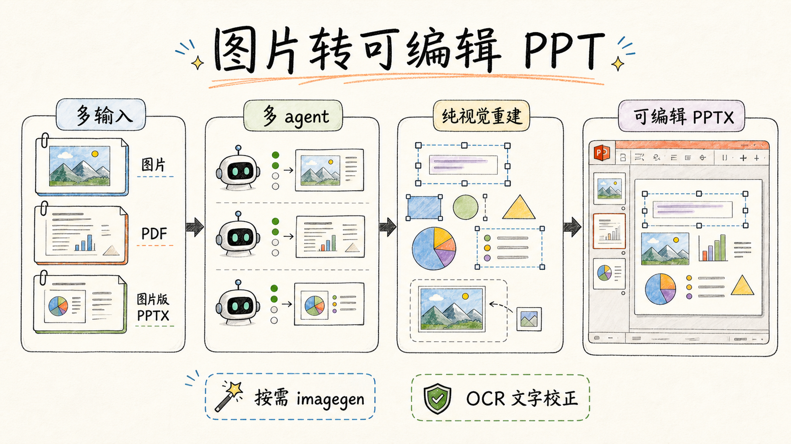
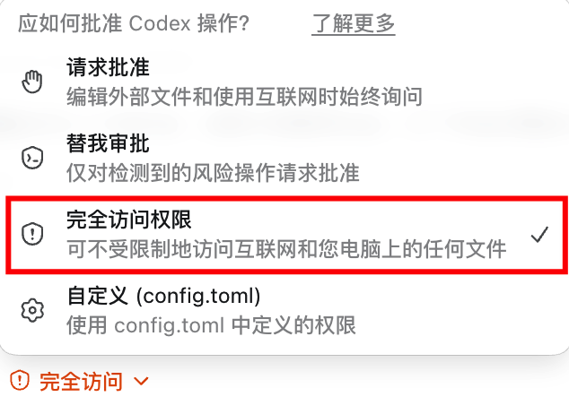
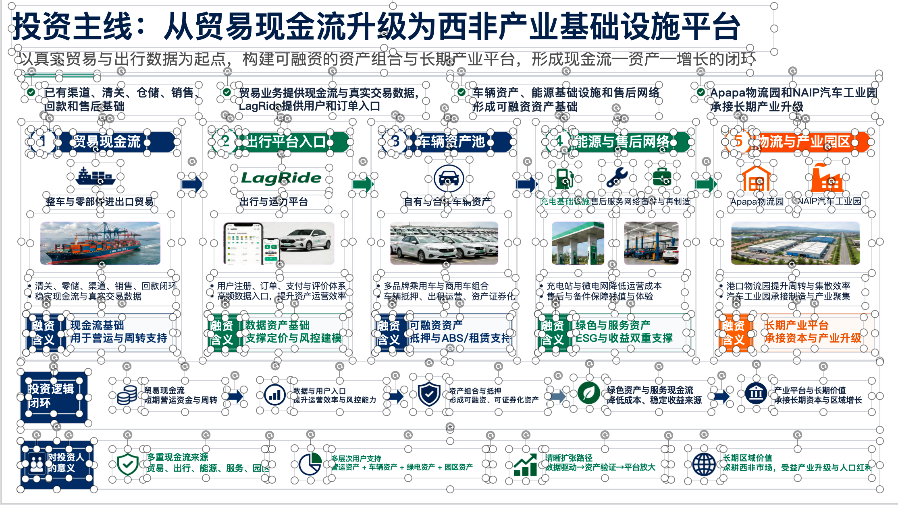
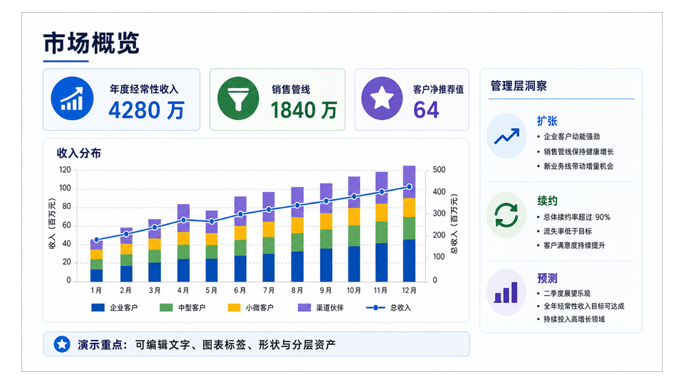
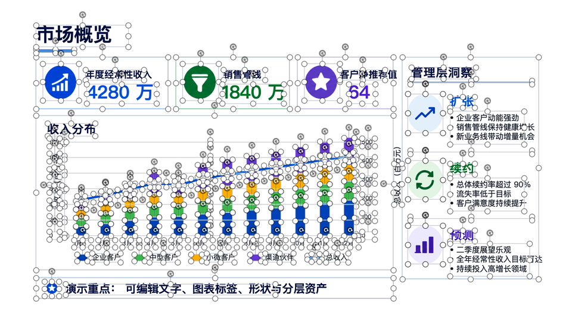
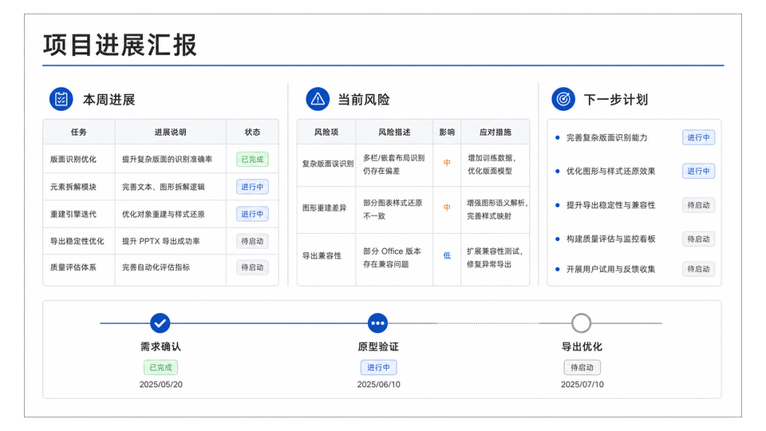
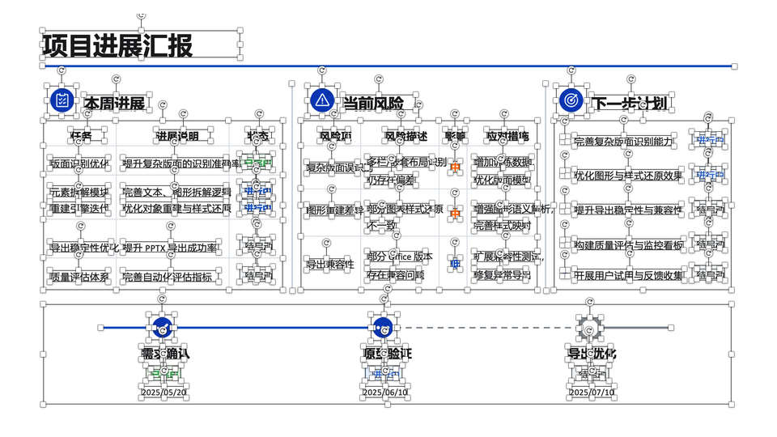
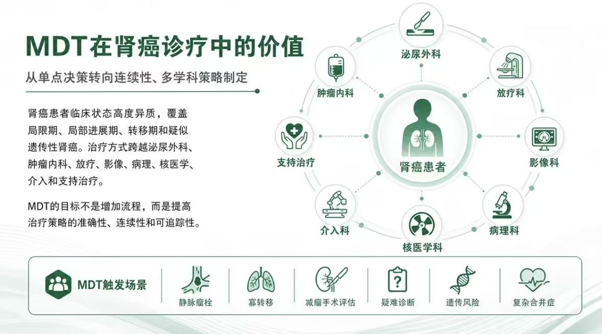
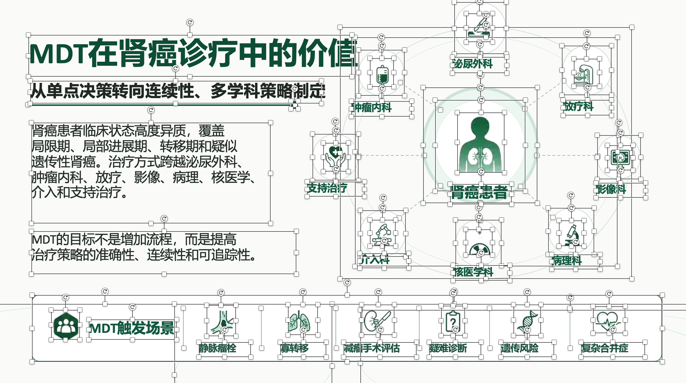

# Image to Editable PPT Skill

**简体中文** · [English](README_en.md) · [한국어](README_ko.md)

[](https://ningzimu.github.io/image-to-editable-ppt-skill/#/) [](https://t.me/CodexPPT) [](https://github.com/ningzimu/image-to-editable-ppt-skill/stargazers) [](https://github.com/ningzimu/image-to-editable-ppt-skill/forks)

https://github.com/user-attachments/assets/6e60b3a1-4fd9-4225-9a12-ace8f2aa67a9



一个用于把图片、PDF、图片版PPT 转成可编辑 PowerPoint 的 skill。它先把输入归一化为逐页任务，再重建为 `.pptx`：可读文字尽量恢复为原生文本框，简单几何尽量恢复为 PowerPoint 形状，复杂视觉元素保留为带来源记录的独立图片资产。

它适合把截图式或图片式幻灯片变成更容易二次编辑的 PPT，让文字、简单形状和视觉素材尽量分开调整。

## 赞助

<table>
<tr>
<td width="180" align="center"><br><strong>Codia NoteSlide</strong></td>
<td><strong>批量图片转 PPT 的高效选择。</strong>大量图片或 PDF 需要转成可编辑 PPT？Codia NoteSlide 提供快速、价格亲民的在线转换服务，适合批量处理。已经订阅 ChatGPT，希望通过 Codex 逐页重建、反复调整文字与布局的用户，可以继续使用本项目。 <a href="https://codia.ai/noteslide/r/12daee802"><strong>体验 Codia NoteSlide →</strong></a></td>
</tr>
<tr>
<td width="180" align="center"><br><strong>Spire.Presentation for Python</strong></td>
<td><strong>把生成的可编辑 PPT 进一步自动化处理。</strong>通过 Python 以编程方式编辑、转换并生成 PowerPoint 文件，支持 AI Agent 借助代码直接完成后续文档操作。 <a href="https://www.e-iceblue.com/Introduce/presentation-for-python.html?aff_id=420"><strong>体验 Spire.Presentation for Python →</strong></a></td>
</tr>
</table>

> [!IMPORTANT]
> **建议在 Codex 中使用“完全访问权限”执行本 skill。**
>
> 本 skill 运行时间较长，并且会自动执行 OCR、图片生成/编辑、文件读写、子 agent 分派和长时间轮询等步骤。“请求批准”模式会频繁打断执行，可能阻塞部分步骤，尤其是在子 agent 环境里。
>
> “替我审批”模式已知仍可能在 OCR 阶段、ChatGPT 图片生成/编辑阶段或第三方 API 调用阶段拦截请求，要求你手动审批；如果你不在电脑旁，转换流程会停住。
>
> 本 skill 会在转换过程中自动调用百度 PaddleOCR-VL 接口（如果已配置 Token）来校正页面文字框、字体大小和字号分组。图片生成/编辑会优先调用 Codex 内置 `image_gen.imagegen`；只有内置工具不可用、调用报错、编辑输入不可读或没有返回有效本地图片时，才降级到 `editppt image`（Codex OAuth → OpenAI-compatible API）。这些调用是把图片式页面重建成可编辑 PPT 的必要步骤。
>
> 

> [!WARNING]
> 页面验证失败时优先局部修复并复用已核验的素材；当前输出通过检查后即完成，不因可接受的小毛边重复生成。常规步骤自主执行；缺少 OCR Token 或 OCR 受阻时仍会询问用户。复杂页面仍可能消耗较多 token。
>
> **推荐 ChatGPT Pro 用户使用；Plus 用户请谨慎使用。**
>
> 复原一个 10 页 PPT 有可能消耗完你的 5 小时额度。单页PPT复原时间可能在10min以上。单页/单图输入可由主 agent 按同一页面重建流程本地执行；多页输入会按并发槽位分派给 page worker 处理。
>
> **如果没有强烈的可编辑需求，请不要使用这个 skill。**
>
> 更轻量的做法是直接使用 gpt-image-2.5-sunburst 的图像编辑能力：把你不满意的那一页 PPT 图片发给它，让它针对性修改，并返回修改后的图片。

> [!TIP]
> 本 skill 不负责从文章、报告、大纲或想法直接生成全新 PPT。如果你要做的是“生成一份 PPT”，可以使用 [codex-ppt-skill](https://github.com/ningzimu/codex-ppt-skill)。
>
> 关于 `codex-ppt` 和 `image-to-editable-ppt` 这两个技能的详细介绍，参见 [skill_duo_intro.pdf](assets/skill_duo_intro.pdf)。该 PPT 由 `codex-ppt` skill 生成，提示词为：“请分别阅读 Codex PPT和 Image to Editable PPT 这两个技能的内容，然后用 Codex PPT 帮我做一个PPT吧，20页，每个技能的介绍10页。”
>
> 另外，关于这个可编辑 PPT Skill 设计和调优的实践经验，可以看这篇文章：[2000 个 GitHub Star 换来的经验：好的 AI Skill 是调出来的，不是写出来的](https://mp.weixin.qq.com/s/LaxWBX-nogHPpSxlk-Vs8Q)。

## 转换效果示例

<table>
  <tr>
    <th>原图</th>
    <th>转换后可编辑效果</th>
  </tr>
  <tr>
    <td></td>
    <td></td>
  </tr>
  <tr>
    <td></td>
    <td></td>
  </tr>
  <tr>
    <td></td>
    <td></td>
  </tr>
  <tr>
    <td></td>
    <td></td>
  </tr>
</table>

## 特点

- 适用场景广泛，支持多种输入：单张图片、多张图片、多页 PDF、图片版PPT 到可编辑 `.pptx`。
- 单页/单图输入可由主 agent 本地执行同一页面重建流程；多页输入由主 agent 分派给 page worker/subagent，并按 `max_concurrent_pages` 并行处理。
- 图片生成和编辑优先使用 Codex 内置 `image_gen.imagegen`；满足明确降级条件时才进入 `editppt image` CLI，由 CLI 依次选择本机 Codex OAuth 和 OpenAI-compatible API。
- 第三方 API fallback 配置保存在 `~/.editppt/config.yaml`；Windows 下对应 `%USERPROFILE%\.editppt\config.yaml`。
- 文字大小与位置由测量驱动：prepare 阶段为每页生成文字标注（框坐标 + 字号 + 字号分组），模型按测量值还原文字，同级文字字号自动保持一致。
- 多张图片按提供顺序生成页面；PDF 和 `.pptx` 保留原页码顺序。
- `.pptx` 输入的页面备注会复制到输出对应页，备注内容不改动。
- 根据具体页面情况决定是否通过已确认 image backend 做图片分层抽取；需要时用稀疏 asset sheet 合并前景素材，优先把图标放在一个素材板上，并保留充足间隙便于后续分离。
- 素材卡默认使用与主体颜色区分明显的纯色背景，去背后按对象区域裁切，保留分离的小笔画。分割成功不代表图标与原图完全一致，仍需逐项核对。
- 支持普通行列表格重建为 PowerPoint 原生表格，保留可编辑单元格、行列尺寸、矩形合并和基础样式。
- 支持复杂视觉页的混合策略：可编辑文字 + 简单形状 + 独立图片资产。
- 支持完整的原生曲线路径、虚线样式和端点箭头，可整体调整线条形状与样式；曲线路径不等同于数据驱动图表。 在 PowerPoint 中，右键曲线选择“编辑顶点”，再点端点或顶点，拖动出现的白色控制手柄即可调整曲度。

## 适用场景

- 把一张或多张 slide 图片重建成可调整文字和元素位置的 PPT。
- 把多张图片或多页 PDF 转成一个多页 `.pptx`。
- 把图片版PPT页面转换为更容易二次编辑的 `.pptx`，并保留原页面备注。
- 复刻单页视觉设计，同时保留文本可编辑性。
- 对比源图与输出页面，定位缺字、错位或资产缺失。

## 运行要求

- 单页/单图输入不需要创建 page worker，但仍必须走同一页面 prompt、产物和 `editppt run record` 校验流程。多页输入需要 agent 能分派 page worker/subagent；如果不能创建 page worker，应换到支持 page worker 的环境执行。
- 复杂背景补全、前景图标提取、透明 asset sheet 和局部图片编辑按页面串行执行，并优先使用内置 `image_gen.imagegen`。
- 内置工具满足降级条件时才进入 CLI fallback；如果本机有 Codex OAuth（`~/.codex/auth.json`），CLI 会直接使用，否则使用 API fallback。
- API fallback 配置保存在 `~/.editppt/config.yaml`；Windows 下对应 `%USERPROFILE%\.editppt\config.yaml`。
- 文字大小与位置的校正需要一个第三方 OCR Token（百度 AI Studio，免费），详见下文「文字校正与 OCR Token」；未配置时退化为内置离线检测，文字还原质量会打折扣。

## 图片 Backend 与第三方 API 配置

完整后端优先级是：Codex 内置 `image_gen.imagegen` → Codex OAuth → OpenAI-compatible API。内置工具由 agent 直接调用，Python/`editppt` CLI 不能调用或探测它；只有内置工具不可用/不可调用、调用报错、编辑输入不可读或没有返回有效本地图片时，才进入 `editppt image` CLI fallback。CLI 内部优先使用本机 Codex OAuth；如果不可用，再读取 `~/.editppt/config.yaml` 或环境变量里的 OpenAI-compatible API 配置。

内置生图只需要 `prompt`；内置编辑图只需要 `prompt` 和本地绝对路径 `referenced_image_paths`，并且编辑前必须先查看输入图。内置工具没有 `mask`、`model`、`size`、`quality`、`out` 等参数，缺少这些参数绝不触发 fallback。成功后只接收工具明确返回的本地路径（包括 `output_hint`），验证文件有效再导入；不会扫描目录猜测“最新文件”。

CLI fallback 的 `editppt image generate/edit` 参数面保持精简：请求输入只需要 `--prompt` 或 `--prompt-file`，编辑图还需要 `--image`；页面重建时应显式传 `--out`。实用控制只保留 `--model`、`--size`、`--quality`、`--force`、`--dry-run`、`--timeout`，以及编辑图专用的 `--mask`。CLI 不会透传其它 image API 选项。

通常不需要你自己配置。只有这些情况才需要让 AI 帮你配置 API fallback：

- 用户明确要求使用第三方 API 或 OpenAI 兼容中转站。
- 在 Claude Code、OpenClaw、Hermes Agent 等非 Codex 环境中使用，并且没有可用的 Codex OAuth auth。
- `editppt image` 报告 Codex OAuth 和 `OPENAI_API_KEY` 都不可用。

如果需要第三方 API fallback，告诉 AI 你要使用的服务、base URL、模型名和 API key 即可。AI 会在执行过程中完成环境检查和配置写入，把凭据保存在用户级配置 `~/.editppt/config.yaml`（Windows 下为 `%USERPROFILE%\.editppt\config.yaml`），并在输出里遮蔽敏感值。不要把 API key 写进项目目录、run 目录或 skill 目录。

## 文字校正与 OCR Token（推荐）

本 skill 通过第三方 OCR 服务（PaddleOCR-VL）来**校正文字的大小和位置**：转换开始时会把整个输入作为一个批量任务提交识别，为每页生成文字标注（精确的框坐标、按源图墨水实测的字号、同级字号分组和识别出的文字内容），AI 在重建时以这些测量值为准，文字不再依赖目测。

**你只需要做一个动作——申请 Token**：到百度 AI Studio 申请 Access Token：<https://aistudio.baidu.com/account/accessToken>。**对个人使用来说，目前免费额度完全够用，可以放心申请，无额外费用。**

不需要手动执行任何命令：本 skill 依赖的 `editppt` 命令行工具是 **AI 在执行 skill 的过程中自动安装的**，配置也由 AI 代劳。首次使用时如果还没配置 Token，AI 会主动询问你一次——把申请到的 Token 发给它即可，AI 会帮你写入用户级配置（与图片 API 凭据同一个文件，遮蔽存储），一次配置长期生效，之后不再提示。

不提供 Token 也能运行：skill 会退化为内置的离线检测器（纯几何测量——知道文字在哪、多大，但不识别内容），文字还原质量会有折扣。

## 已知问题

- 其他 agent 需要支持 skill 加载、文件读写和 CLI 执行；多页任务还需要 page worker/subagent 分派机制。
- 内置图片工具依赖当前 agent runtime 是否提供 `image_gen.imagegen`；Codex OAuth 路径依赖本机 Codex auth 和订阅侧图片额度；API fallback 依赖所选 OpenAI-compatible 服务的图片生成/编辑能力。
- 本 skill有着相对复杂的流程控制，Token花费比较高。将一个图片PPT转换成可编辑PPT的成本，**可能是生成图片PPT成本的2-3倍**。
- 受限于模型基础理解能力和对 skill 的遵循能力，**不保证 gpt-5.5 以下模型的使用效果**。
- 部分图片元素和文字位置可能会有轻微偏移，**不能保证 100% 复刻原始页面**。

## 安装

```text
安装 image-to-editable-ppt 这个 skill，地址是 https://github.com/ningzimu/image-to-editable-ppt-skill
```

安装 skill 后，正常转换、图片 API fallback 和 OCR Token 配置都由 AI 在执行过程中检查和处理；你只需要在 AI 询问时提供第三方 API 信息或 OCR Token。

## 更新

```text
更新 image-to-editable-ppt 这个 skill，地址是 https://github.com/ningzimu/image-to-editable-ppt-skill
```

## 使用方式

在支持显式选择 skill 的 agent 里，可以用对应语法选中 `image-to-editable-ppt`；Codex 中可使用 `$image-to-editable-ppt`。图片、PDF 和 `.pptx` 可以直接粘贴或附加到对话框，也可以提供本地路径：

```text
$image-to-editable-ppt 把这张图片转成可编辑 PPT。
$image-to-editable-ppt 把这些图片转成一个可编辑 PPT。
$image-to-editable-ppt 把 <path-to-deck.pdf> 转成可编辑 PPT。
$image-to-editable-ppt 把 <path-to-image-based.pptx> 转成可编辑 PPT。
```

skill 通常会完成这些步骤：

1. 创建独立任务目录，把输入归一化为 `pages/page_NNN/source.png`，并写入默认 `editppt image` backend。
2. 如果只有 1 页，主 agent 先用 `editppt run dispatch --local` 认领页面，再按同一页面 prompt 本地重建；如果有多页，则按 `max_concurrent_pages` 分批分派给 page worker 重建。
3. 页面重建者（主 agent 本地模式或 page worker）负责自己的页面目录，完成页面重建、自检和 page-local 修正。
4. 每页创建 manifest，重建可编辑文本、简单形状和图片资产。
5. 用 `editppt` 命令记录 dispatch、page result 和 accepted 状态。
6. 主 agent 用 `editppt run finalize` 按页顺序读取已记录的 `manifest.json` 重建最终 `.pptx`，复制 `.pptx` 页面备注，并运行 deck validation。

## 输出结构

输出始终是 PowerPoint `.pptx`：

| 输入      | 输出                                           |
| --------- | ---------------------------------------------- |
| 1 张图片  | 1 页 `.pptx`                                 |
| 多张图片  | 多页 `.pptx`，每张图片 1 页，按提供顺序排列  |
| 多页 PDF  | 多页 `.pptx`，PDF 第 N 页对应输出第 N 页     |
| 图片版PPT | 页数一致的 `.pptx`，原第 N 页对应输出第 N 页 |

只有 `.pptx` 输入会处理页面备注。备注由主 agent 按页原样复制到输出 PPTX：不翻译、不摘要、不改写，也不交给 page worker 处理。

每次转换必须使用一个独立输出目录，所有中间文件和最终结果都保存在其中：

```text
output/image-to-editable-ppt/{job-id}/        # 单次转换任务目录
├── input/                                    # 原始输入文件副本
├── deck_manifest.json                        # 整个 deck 的页面清单和输出配置
├── page_jobs.json                            # 每页分派和完成状态
├── run_state.json                            # 当前任务的整体运行状态
├── notes_manifest.json                       # PPTX 页面备注提取与映射记录
├── final/                                    # 最终输出目录
│   ├── {origin}_edited.pptx                  # 最终可编辑 PPTX
│   ├── validation.json                       # 最终 deck 校验结果
│   └── run_summary.json                      # 本次转换摘要
└── pages/                                    # 按页拆分的重建工作区
    ├── page_001/                             # 第 1 页工作目录
    │   ├── source.png                        # 归一化后的页面源图
    │   ├── page_request.json                 # 页面请求和 image backend
    │   ├── worker-prompt.md                  # 生成给页面重建者的提示词
    │   ├── imagegen-jobs.json                # 本页图片生成/编辑调用和结果记录
    │   ├── assets/                           # 本页拆出的独立图片资产
    │   ├── page.pptx                         # 本页单页 PPTX；record 阶段用于校验和交付性检查
    │   ├── preview.png                       # 本页重建预览图
    │   ├── split_assets_contact.png          # 本页资产切分检查图
    │   ├── manifest.json                     # 本页文本、形状和资产描述；finalize 的权威输入
    │   ├── validation.json                   # 本页校验结果
    │   └── page_result.json                  # 本页产物索引
    └── page_002/                             # 后续页面工作目录
        └── ...
```

## 边界

- 这个 skill 面向输入页面的可编辑重建，不是从零生成整套 PPT 内容。
- 单页/单图输入可由主 agent 本地重建；多页输入通过 page worker/subagent 并行重建。
- 复杂视觉资产需要可用的内置图片工具或 CLI fallback；如果两者都无法生成合规资产，对应页面会校验失败，不会用近似图形替代。
- 对照片、插画、纹理、手绘装饰等复杂视觉元素，通常只能作为独立图片资产移动，不能保证内部对象可编辑。
- 原生表格暂不支持斜线表头和单元格内嵌图片；文字、行列或合并关系不清楚时先复查源图与 OCR，仍无法辨认则报告具体缺失，不猜测内容或结构。图表、流程图仍按可编辑结构重建。
- 视觉相似不等于可编辑。最终判断应同时看 PPTX 结构、文本覆盖、资产来源和预览/diff。

## 仓库结构

```text
.
├── .github/                              # GitHub 工作流和仓库检查配置
├── skills/                               # Skill 安装包目录
│   └── image-to-editable-ppt/            # 可安装的 image-to-editable-ppt skill
│       ├── SKILL.md                      # skill 入口说明和执行规则
│       ├── agents/                       # Agent 展示用的 skill 元数据
│       ├── cli/                          # 自包含 `editppt` CLI 和确定性 runtime 模块
│       ├── references/                   # 页面重建、状态机、QA 等参考规范
│       ├── prompts/                      # 页面重建 prompt 模板
│       └── scripts/                      # skill 内 prompt 组装脚本
├── AGENTS.md                             # 仓库级协作和编辑规则
├── CHANGELOG.md                          # 用户可见变更记录
├── LICENSE                               # 开源许可证
├── README.md                             # 中文说明文档
├── README_en.md                          # 英文说明文档
└── README_ko.md                          # 韩文说明文档
```

## 支持

遇到问题？请查看[使用文档](https://ningzimu.github.io/image-to-editable-ppt-skill/#/)，加入 [CodexPPT](https://t.me/CodexPPT)，或[提交 Issue](https://github.com/ningzimu/image-to-editable-ppt-skill/issues/new)。

## 许可证

MIT
